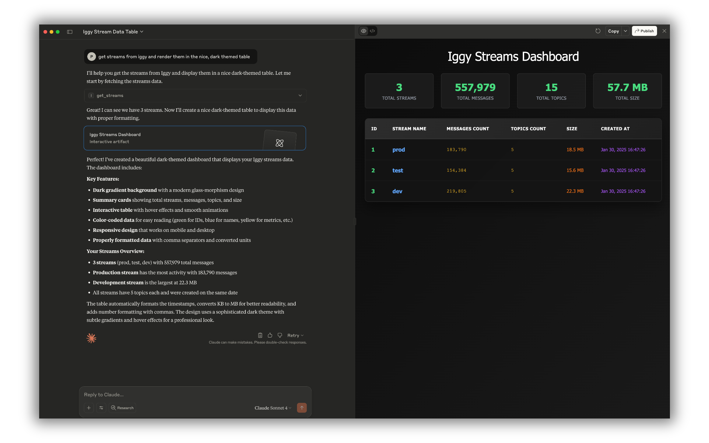

# Apache Messenger MCP Server

The [Model Context Protocol](https://modelcontextprotocol.io) (MCP) is an open protocol that standardizes how applications provide context to LLMs. The Apache Messenger MCP Server is an implementation of the MCP protocol for the message streaming infrastructure.

To start the MCP server, simply run `cargo run --bin messenger-mcp`.

The [docker image](https://hub.docker.com/r/apache/messenger-mcp) is available, and can be fetched via `docker pull apache/messenger-mcp`.

The minimal viable configuration requires at least the Messenger credentials, to create the connection with the running Messenger server using TCP with which the MCP server will communicate. You can choose between HTTP and STDIO transports (e.g. for the local usage with tools such as [Claude Desktop](https://claude.ai/download) choose `stdio`).

```toml
transport = "stdio" # http or stdio are supported

[messenger]
address = "localhost:8090" # TCP address of the Messenger server
username = "messenger"
password = "messenger"
# token = "secret" # Personal Access Token (PAT) can be used instead of username and password
# consumer = "messenger-mcp" # Optional consumer name

[http] # Optional HTTP API configuration
address = "127.0.0.1:8082"
path = "/mcp"

[http.cors] # Optional CORS configuration for HTTP API
enabled = false
allowed_methods = ["GET", "POST", "PUT", "DELETE"]
allowed_origins = ["*"]
allowed_headers = ["content-type"]
exposed_headers = [""]
allow_credentials = false
allow_private_network = false

[http.tls] # Optional TLS configuration for HTTP API
enabled = false
cert = "core/certs/messenger_cert.pem"
key = "core/certs/messenger_key.pem"

[permissions]
create = true
read = true
update = true
delete = true
```

Keep in mind that either of `toml`, `yaml`, or `json` formats are supported for the configuration file. The path to the configuration can be overriden by `MESSENGER_MCP_CONFIG_PATH` environment variable. Each configuration section can be also additionally updated by using the following convention `MESSENGER_MCP_SECTION_NAME.KEY_NAME` e.g. `MESSENGER_MCP_MESSENGER_USERNAME` and so on.

Here's the example configuration to be used with Claude Desktop:

```json
{
  "mcpServers": {
    "messenger": {
      "command": "/path/to/messenger-mcp",
      "args": [],
      "env": {
        "MESSENGER_MCP_TRANSPORT": "stdio"
      }
    }
  }
}
```

**Remember to use the appropriate Messenger account credentials for your environment** (e.g. create the user with read-only permissions to avoid modifying the data). On top of this, you can also configure the `permissions` for the MCP server to control which operations are allowed (this will be checked first, before forwarding the actual request to the Messenger server).


