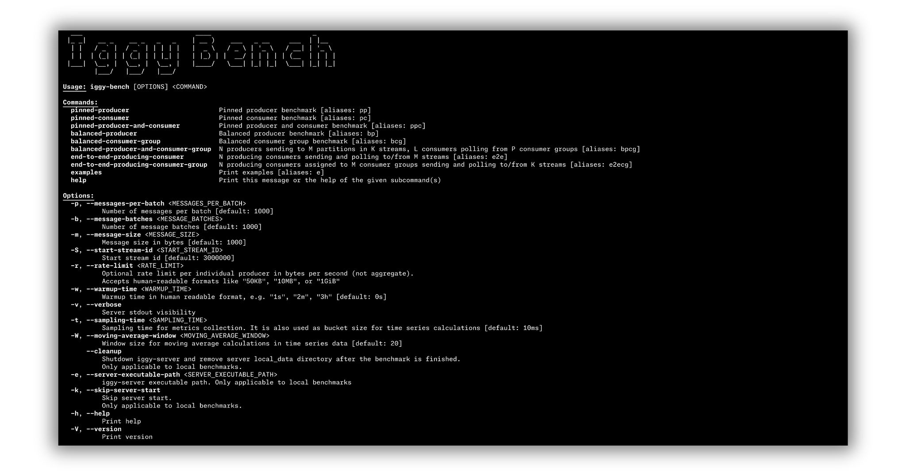

# Apache Messenger Bench CLI

The interactive Bench CLI allows you to perform various benchmarking on the Apache Messenger server.

Messenger Bench CLI can be installed with `cargo install messenger-bench` and then simply accessed by typing `messenger-bench` in your terminal.

