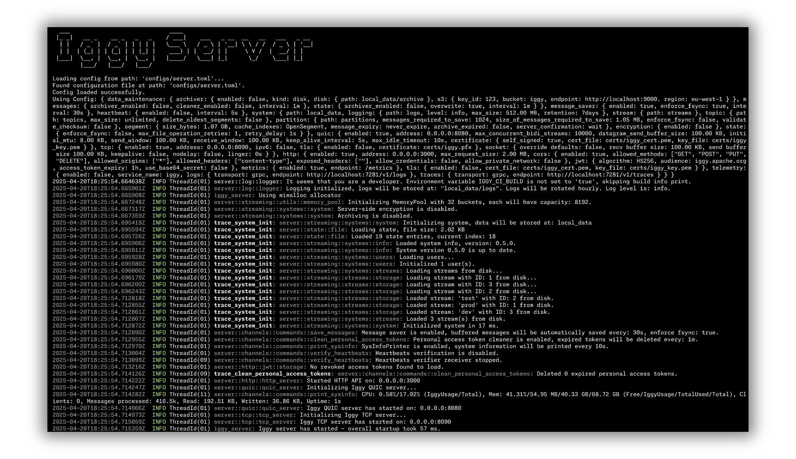
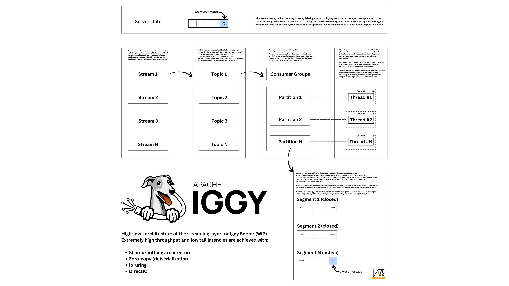

# Apache Messenger Server

This is the core server component of Apache Messenger. You can run it directly with `cargo run --bin messenger-server --release` or use the Docker image `apache/messenger:latest` (the `edge` tag is for the latest development version).

The configuration file is located at [core/configs/server.toml](https://github.com/apache/messenger/blob/master/core/configs/server.toml). You can customize the server settings by modifying this file or by using environment variables e.g. `MESSENGER_TCP_ADDRESS=0.0.0.0:8090`.

