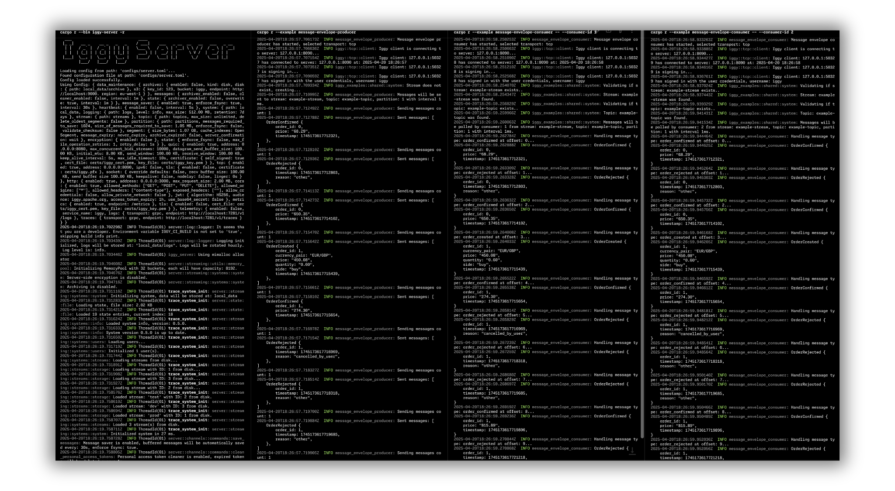

# Messenger Examples

This directory contains comprehensive sample applications that showcase various usage patterns of the Messenger client SDK, from basic operations to advanced multi-tenant scenarios. To learn more about building applications with Messenger, please refer to the [getting started](https://messenger.apache.org/docs/introduction/getting-started) guide.

## Running Examples

To run any example, first start the server with `cargo run --bin messenger-server` and then run the desired example.

For server configuration options and help:

```bash
cargo run --bin messenger-server -- --help
```

You can also customize the server using environment variables:

```bash
## Example: Enable HTTP transport and set custom address
MESSENGER_HTTP_ENABLED=true MESSENGER_TCP_ADDRESS=0.0.0.0:8090 cargo run --bin messenger-server
```

You can run multiple producers and consumers simultaneously to observe how messages are distributed across clients.



## Basic Examples

### Getting Started

Perfect introduction for newcomers to Messenger:

```bash
go run ./getting-started/producer/main.go
go run ./getting-started/consumer/main.go
```

## Example Structure

All examples can be executed directly from the repository. Follow these steps:

1. **Start the Messenger server**: `cargo run --bin messenger-server`
2. **Run desired example**: `go run ./xxx/xxx/main.go`
3. **Check source code**: Examples include detailed comments explaining concepts and usage patterns

These examples use MessengerClient with TCP transport and demonstrate automatic stream/topic creation with basic message handling.

The examples are automatically tested via `scripts/run-go-examples-from-readme.sh` to ensure they remain functional and up-to-date with the latest API changes.
