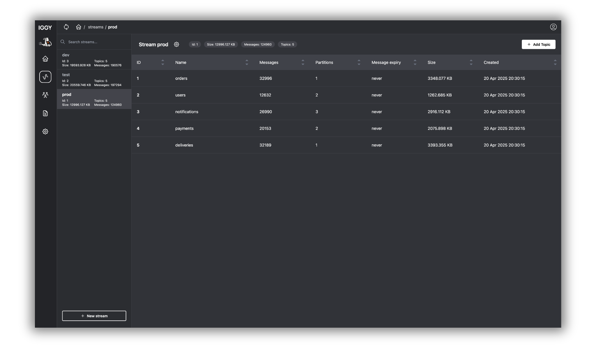

# Apache Messenger Web UI

This project hosts the web user interface for Apache Messenger. The web UI is built using SvelteKit.



## Overview

The Messenger Web UI provides a user-friendly panel for managing various aspects of the Messenger platform, including streams, topics, partitions, and more.

The [docker image](https://hub.docker.com/r/apache/messenger-web-ui) is available, and can be fetched via `docker pull apache/messenger-web-ui`.

### Getting Started

1. **Run Messenger server first**

   ```sh
   docker pull apache/messenger:latest
   ```

   ```sh
   docker run -p 3000:3000 -p 8090:8090 apache/messenger:latest
   ```

2. **Clone the repository:**

   ```sh
   git clone https://github.com/apache/messenger.git
   ```

3. **Build the project:**

   ```sh
   cd web
   npm install
   ```

4. **Run the project:**

   ```sh
   npm run dev
   ```

   **To expose port in local network run:**

   ```sh
   npm run dev -- --host --port 3333
   ```

   **If Messenger server was run using cargo directly we need to change PUBLIC_MESSENGER_API_URL env in web ui root folder to:**

   ```sh
   PUBLIC_MESSENGER_API_URL=http://0.0.0.0:3000
   ```

   **instead of**

   ```sh
   PUBLIC_MESSENGER_API_URL=http://localhost:3000
   ```

## Roadmap

- [x] Authorization
- [x] Allow manual interval setting for auto-refresh
- [x] Introduce dark mode
- [x] Enable CRUD operations on Streams
- [x] Enable CRUD operations on Topics
- [ ] Messages management
- [ ] General UI improvements
- [ ] Permission management (in progress)
- [x] GitHub actions CI/CD
- [x] Publish to Dockerhub as separate Image

## Contributing

Feel free to contribute to the project. Your feedback and contributions are highly appreciated!
